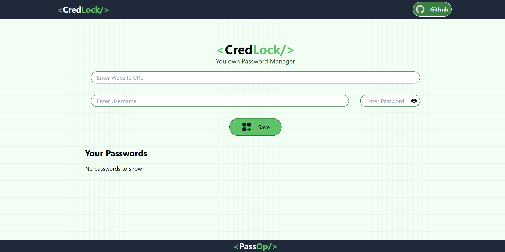

# 🔐 CredLock

CredLock is a secure password manager that allows users to store website URLs, usernames, and passwords safely. Built using React and Tailwind CSS, it ensures a user-friendly and responsive interface.

## 🚀 Features

- 🔒 Securely store website credentials (URL, username, password)
- 🔑 Easy access to saved credentials
- 🔄 Copy credentials to clipboard
- 🎨 Responsive UI with Tailwind CSS

## 🛠️ Tech Stack

- **Frontend:** React.js, Tailwind CSS
- **State Management:** React Context API
- **Storage:** LocalStorage / Secure Backend (Future Integration)
- **Deployment:** netlify

## 📌 Installation & Setup

### Prerequisites
Ensure you have the following installed:
- 📌 Node.js (v16+)

## 🚀 Deployment
- **Live URL:** [CredLock](https://credlock.netlify.app)
- **Frontend:** Hosted on netlify

## 🎯 Usage
1. Add website credentials (URL, username, password).
2. View and manage stored credentials.
3. Copy credentials securely with a single click.

## 📸 Screenshots

### 🏠 Home Page

